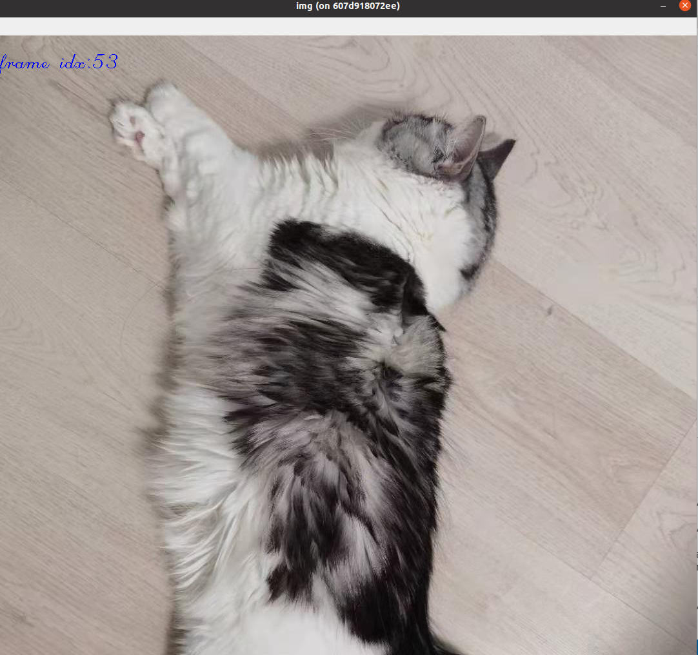

# zeromq的示例代码
本项目主要展示了3中不同zeromq的示例代码以及一个简单的python socket使用例子。
- py-py
    这个项目有两个py文件，分别展示了request&reply模式 以及pub&sub模式.
    request&reply模式模拟了客户端向服务器端发送函数计算的功能，服务器端收到计算请求后开始计算， 然后将计算结果返回给client端。

- cpp-proto-py

    这个例子中， cpp代码会作为一个publisher, python代码会作为一个subscriber, cpp将一个结构体通过protoc序列化，发送给subscriber。

- cvmat-cpp-py
    
    这个例子是将一个OpenCV的cv::Mat数据结构通过protobuf序列化，发送给一个python的subscriber.
- naive_socket_example
    
    一个简单的server&client例子
- cppzmq

该文件夹是libzmq的cpp包装，方便cpp调用， 只包含头文件。具体api使用可以参考[cppzmq](https://github.com/zeromq/cppzmq)
- cmake

    该目录包含了两个cmake文件，方便调用protobuf和zmq
## 依赖安装

首先安装OpenCV， 这个可以参考OpenCV官方网站。
然后安装其他依赖：
```bash
# 安装zmq和protobuf
apt-get install libzmq3-dev protobuf-compiler -y
# 安装python 版本的zmq, protobuf以及opencv和numpy
pip3 install pyzmq  protobuf opencv-python numpy
```
## 运行
- naive_socket_example

    ```python
    python socket_server.py
    python socket_client.py
    ```
    参考链接:https://realpython.com/python-sockets/
- py-py(rep/req)

    ```python
    # 启动客户端
    python rep_req.py 1

    # 启动服务端
    python rep_req.py
    ```

- py-py(pub/sub)
    
    ```python
    # 启动sub端
    python pub_sub.py 1
    # 启动client端
    python pub_sub.py 
    ```
- cpp-proto-py
   
    ```bash
    cd cpp-proto-py
    mkdir build && cd build
    cmake .. && make -j
    ```  
    运行publish端：
    ```bash
    ./pub
    ```
    运行subscribe端
    ```bash
    cd .. && python3 sub.py
    ```
    会得到类似如下结果：
    ```txt
    count: 8
    joint_position: 1.100000023841858
    joint_position: 2.0999999046325684
    joint_velocity: -1.100000023841858
    joint_velocity: -2.0999999046325684
    ```
- cvmat-cpp-py
  
    这个例子演示了使用OpenCV读取一张图片存储为cvmat格式， 并将mat转换为protobuf格式后通过zmq发送出去， python端会获取该图片并显示出来。
    编译：
    ```bash
    cd cvmat-cpp-py
    mkdir build && cd build
    cd build && cmake .. && make -j
    ```
    运行publish端：
    ```txt
    ./pub
    ```
    运行subscribe端
    ```txt
    cd .. &&  python3 sub.py
    ```
    运行成功的话应该能得到类似下面的结果：
    
    左上角为当前帧的编号，本机测试帧率在200fps左右。

